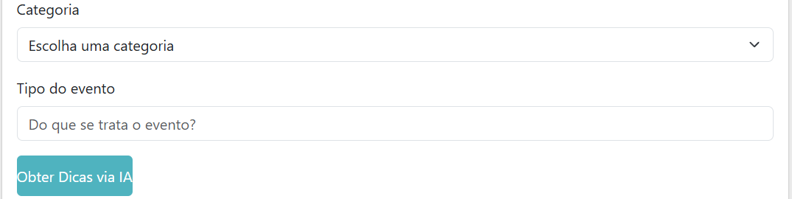

Deixei um botao e um upload na tela de index para o usuario poder utilizar a API backend-image

Além disso adicionei através da api do Gemini uma opção de obter dicas com base na categoria e no tipo de evento que o usuário deseja publicar, e, com isso, utilizar o exemplo de nome e descrição gerado pela IA para o seu próprio evento.

Para usar os recursos da api do Gemini, gere uma chave api no site https://aistudio.google.com/apikey e cole a chave na linha 93 dentro do arquivo cadastrarevento.js. 

Existem duas maneiras de executar o projeto:

- Com docker: Instale o docker desktop, e, após isso, digite no terminal da raiz deste projeto (pi-inteligencia-artificial) o comando docker compose up -d

- Somente com node: Na pasta api/grupo-5, crie um arquivo .env e coloque as variáveis **MONGODB_URL=mongodb://localhost:27017/** E **JWT_SECRET=chave aleatoria**. PS: as variáveis a seguir são apenas exemplos. Em seguida, no mesmo diretório, digite npm install e npm start para executar a api. Agora, em web/grupo-5, digite npm install e npm start para rodar a interface do projeto.